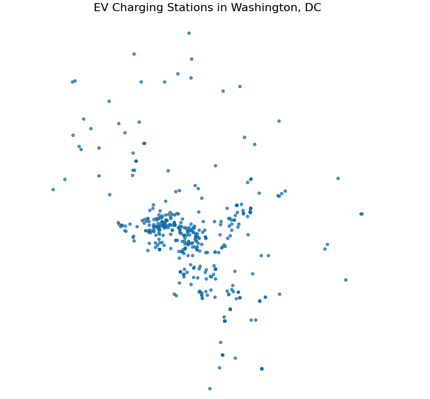
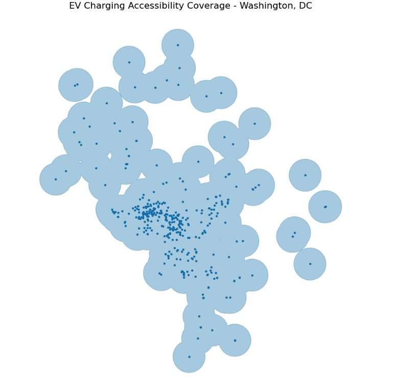
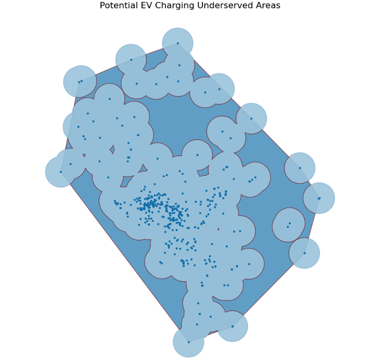
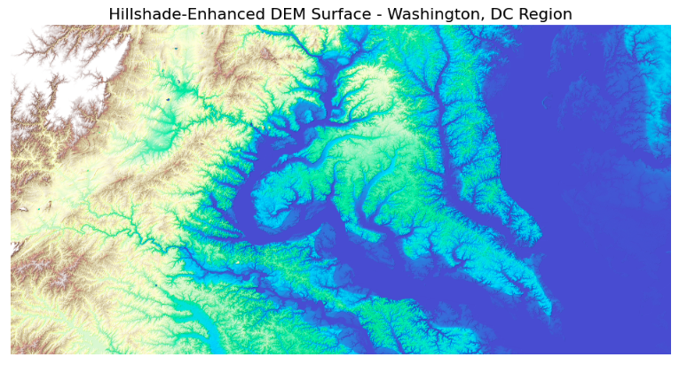
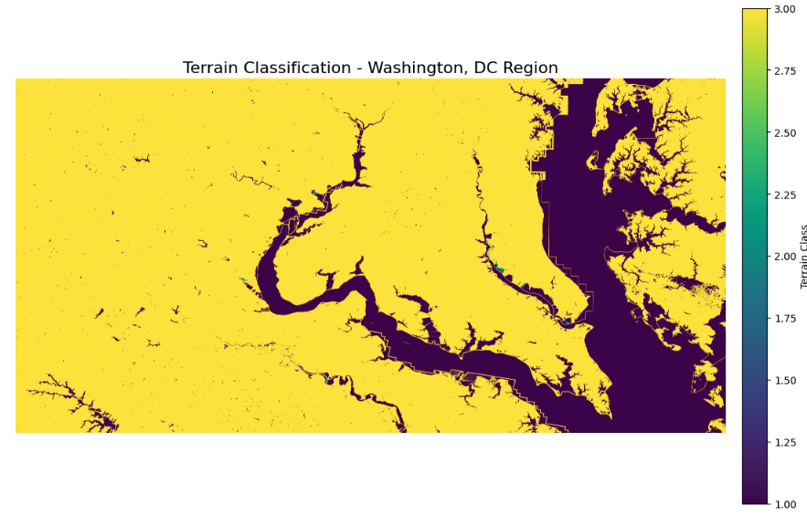
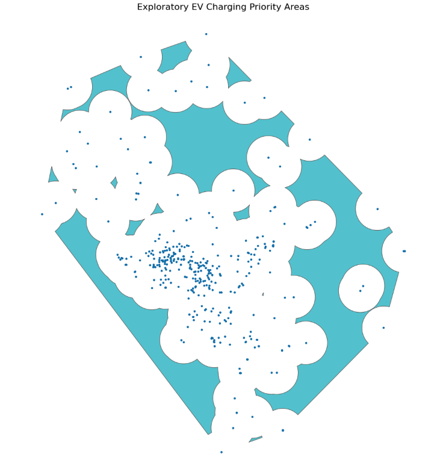
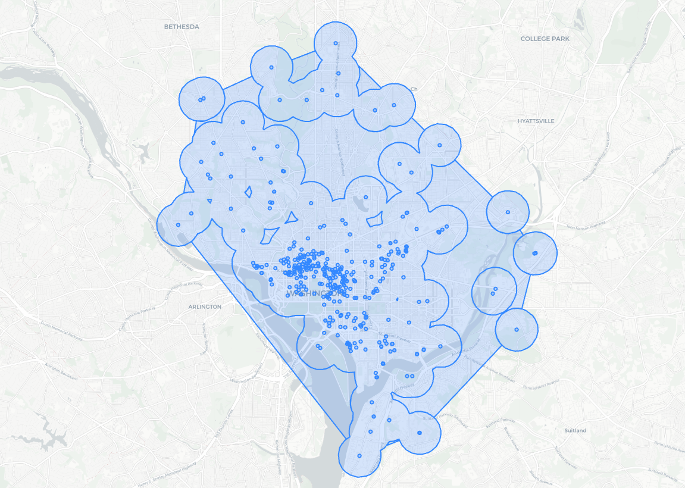

<h1>EV Charging Gap Analyzer</h1>

<h2>Terrain-Aware EV Accessibility Analysis Using Open-Source GIS Tools</h2>

<h2>Project Overview</h2>

As electric vehicle adoption continues to grow, cities need better ways to understand where charging infrastructure is available and where access may still be limited. This project analyzes EV charging accessibility in the Washington, DC region using open-source geospatial tools, public data, and terrain-aware spatial analysis.

The goal is to identify exploratory underserved areas where EV charging access may be limited and to demonstrate how Python-based GIS workflows can support infrastructure planning, accessibility analysis, and decision-making.

This project is designed as a geospatial engineering portfolio case study, not just a simple mapping exercise. It combines vector GIS, raster terrain analysis, REST API integration, spatial overlays, and interactive web mapping.

<h2>Key Skills Demonstrated</h2>

<ul>
  <li>REST API data acquisition</li>
  <li>GeoPandas vector spatial analysis</li>
  <li>Rasterio-based DEM processing</li>
  <li>USGS DEM mosaicing</li>
  <li>Slope derivation and terrain classification</li>
  <li>CRS-aware spatial analysis</li>
  <li>EV charging accessibility modeling</li>
  <li>Underserved area detection</li>
  <li>Exploratory priority scoring</li>
  <li>Interactive Folium web mapping</li>
  <li>Reusable and reproducible GIS workflow design</li>
</ul>

<h2>Project Workflow</h2>

<pre>
NREL EV Charging Station API
        ↓
GeoPandas Spatial Processing
        ↓
EV Accessibility Coverage Modeling
        ↓
Underserved Area Detection
        ↓
USGS 3DEP DEM Processing
        ↓
DEM Merge and Terrain Analysis
        ↓
Slope Derivation and Terrain Classification
        ↓
Exploratory Priority Scoring
        ↓
GIS Layer Exports and Interactive Web Map
</pre>

<h2>Technology Stack</h2>

<ul>
  <li><strong>Python</strong></li>
  <li><strong>GeoPandas</strong></li>
  <li><strong>Rasterio</strong></li>
  <li><strong>GDAL-compatible raster workflows</strong></li>
  <li><strong>Shapely</strong></li>
  <li><strong>Pandas</strong></li>
  <li><strong>NumPy</strong></li>
  <li><strong>Matplotlib</strong></li>
  <li><strong>Folium</strong></li>
  <li><strong>Jupyter Notebook</strong></li>
</ul>

<h2>Data Sources</h2>

<h3>EV Charging Stations</h3>

EV charging station data was retrieved from the <strong>NREL Alternative Fuel Stations API</strong>.

Source: 
<a href="https://developer.nrel.gov/docs/transportation/alt-fuel-stations-v1/">
NREL Alternative Fuel Stations API
</a>

<h3>Terrain Data</h3>

Terrain analysis uses <strong>USGS 3DEP 1/3 arc-second DEM</strong> data downloaded from The National Map Downloader.

Source:
<a href="https://apps.nationalmap.gov/downloader/">
USGS National Map Downloader
</a>

DEM files used locally:

<ul>
  <li><code>USGS_13_n39w077_20260407.tif</code></li>
  <li><code>USGS_13_n39w078_20260407.tif</code></li>
</ul>

Large DEM raster files are intentionally excluded from this GitHub repository because of file-size limits. To reproduce the terrain workflow, download the DEM tiles from the USGS National Map Downloader and place them in:

<pre>
data/raw/dem/
</pre>

<h2>Project Structure</h2>

<pre>
EV Charging Gap Analyzer/
│
├── data/
│   ├── raw/
│   │   └── dem/
│   ├── processed/
│   └── final/
│
├── outputs/
│   ├── maps/
│   ├── tables/
│   └── dc_ev_accessibility_map.html
│
├── notebooks/
│   └── ev_charging_gap_analysis_dc.ipynb
│
├── ev_access_toolkit/
│
├── README.md
├── requirements.txt
├── .gitignore
└── LICENSE
</pre>

<h2>Analysis Summary</h2>

<h3>1. EV Charging Station Distribution</h3>

The project begins by retrieving EV charging station data from a public REST API and converting the records into spatial point geometries. This creates the foundation for infrastructure distribution analysis.

<h3>2. Accessibility Coverage Modeling</h3>

EV charging accessibility is estimated using buffer-based coverage analysis. This provides an interpretable first-stage view of areas that may be within reasonable proximity to existing chargers.

<h3>3. Initial Underserved Area Detection</h3>

Potential underserved areas are identified by comparing estimated accessibility coverage against an exploratory study extent. These areas are not final planning recommendations, but they help demonstrate how service gaps can be detected using spatial overlay analysis.

<h3>4. Terrain Processing</h3>

The project integrates USGS DEM data to account for terrain conditions. DEM tiles are merged into a single raster surface and visualized using hillshade-enhanced rendering to improve terrain interpretation.

<h3>5. Slope and Terrain Classification</h3>

Slope is derived from the merged DEM and classified into generalized terrain categories. This adds a raster-based terrain constraint layer to the accessibility workflow.

<h3>6. Exploratory Priority Areas</h3>

The project combines accessibility gap areas with terrain-aware scoring logic to create exploratory EV charging priority areas. These results are intended for planning review, not final engineering site selection.

<h3>7. Interactive Web Map</h3>

The final workflow exports an interactive Folium web map for exploratory visualization and stakeholder communication.

<h2>Interactive Map Output</h2>

The interactive map is exported as:

<pre>
outputs/dc_ev_accessibility_map.html
</pre>

The map includes:

<ul>
  <li>EV charging stations</li>
  <li>accessibility coverage</li>
  <li>exploratory priority areas</li>
  <li>layer controls</li>
  <li>web-friendly visualization</li>
</ul>

<h2>Technical Notes</h2>

<h3>CRS Strategy</h3>

The workflow uses projected coordinate systems for spatial analysis and converts layers back to WGS84 for web mapping. This separation is important because distance-based GIS operations require reliable linear units, while web maps typically expect latitude and longitude.

<h3>Accessibility Modeling</h3>

This project uses Euclidean buffer analysis as a first-stage accessibility model. While this approach is useful for exploratory analysis, it does not replace network-based service-area modeling.

<h3>Raster Processing</h3>

DEM workflows require careful handling of nodata values, raster bounds, resolution, and visualization stretch. The project includes raster validation, DEM merging, hillshade rendering, slope derivation, and terrain classification.

<h2>Limitations</h2>

<ul>
  <li>The study boundary currently uses an exploratory convex hull extent.</li>
  <li>Accessibility is modeled using Euclidean buffers rather than road-network travel distance.</li>
  <li>Terrain scoring is simplified and exploratory.</li>
  <li>Population density and demographic demand variables are not yet included.</li>
  <li>Charger utilization, capacity, and reliability are not modeled.</li>
  <li>Final infrastructure recommendations would require additional planning, zoning, and transportation data.</li>
</ul>

<h2>Future Improvements</h2>

<ul>
  <li>Replace the temporary study extent with official Washington, DC boundaries.</li>
  <li>Add Census tract demographic and equity indicators.</li>
  <li>Implement network-based service-area analysis.</li>
  <li>Use raster zonal statistics for terrain-aware scoring.</li>
  <li>Incorporate charger utilization and demand estimates.</li>
  <li>Add PostGIS support for scalable spatial querying.</li>
  <li>Package reusable analysis functions into a Python toolkit.</li>
  <li>Deploy an interactive dashboard using Streamlit or another web framework.</li>
</ul>

<h2>How to Run the Project</h2>

<h3>1. Clone the Repository</h3>

<pre>
git clone https://github.com/your-username/ev-charging-gap-analyzer.git
cd ev-charging-gap-analyzer
</pre>

<h3>2. Create and Activate a Virtual Environment</h3>

<pre>
python3 -m venv .venv
source .venv/bin/activate
</pre>

<h3>3. Install Dependencies</h3>

<pre>
pip install -r requirements.txt
</pre>

<h3>4. Launch Jupyter</h3>

<pre>
jupyter lab
</pre>

<h3>5. Open the Notebook</h3>

<pre>
notebooks/ev_charging_gap_analysis_dc.ipynb
</pre>

<h2>Repository Notes</h2>

Large raster files are excluded from GitHub. DEM files should be downloaded separately from USGS and placed in the expected local folder.

Recommended <code>.gitignore</code> entries:

<pre>
data/raw/dem/
*.tif
*.tiff
.venv/
.ipynb_checkpoints/
__pycache__/
.DS_Store
</pre>

<h2>Reusable Python Toolkit</h2>

This repository includes a lightweight Python toolkit named <code>ev_access_toolkit</code>.
The toolkit separates reusable geospatial logic from the notebook narrative and supports a more maintainable geospatial engineering workflow.

The toolkit includes modules for:

<ul>
  <li>NREL API data acquisition</li>
  <li>EV accessibility buffer generation</li>
  <li>Underserved-area detection</li>
  <li>DEM raster validation and merging</li>
  <li>Slope derivation</li>
  <li>Terrain classification</li>
  <li>Interactive web map creation</li>
</ul>
<h2>Author</h2>

<strong>Nahid Mozhdehi</strong>

